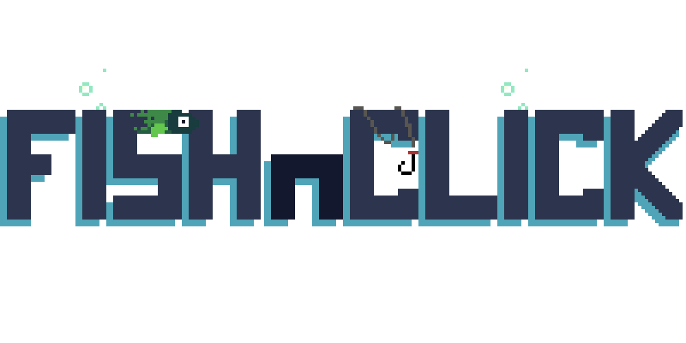
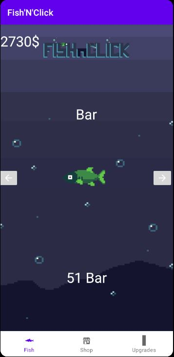
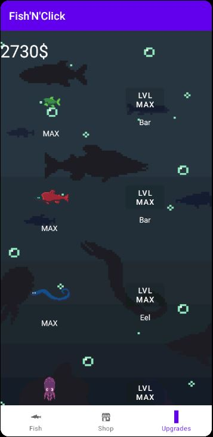
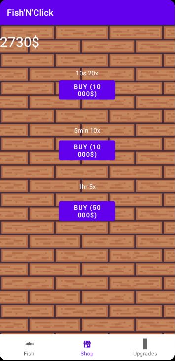

FishAndClick est un jeu vidéo de type "clicker" dont le but est extrêmement simple : produire un maximum de poisson.
Pour ce faire, le joueur devra clicker sur le poisson qu'il veut accumuler. Les poissons rapportent de l'argent, qui permet d'acheter des boosters et d'augmenter le niveau des poissons qui rapportent ainsi plus d'argent.
Le jeu à l'heure actuelle ne connaît pas de fin véritable, amasser juste un max de poisson !

<h1>Différentes vues du jeu</h1>

  <h3>Fenêtre Principale</h3>
  
  Sur cet écran le joueur peut clicker sur le poisson selectionné pour gagner de l'argent. Il peut aussi changer de poisson avec les flèches latérales.
  
  --------------------------------------------------------------------
  
  <h3>Les améliorations</h3>
  
  Sur cet écran le joueur peut améliorer ses poissons en augmentant leurs niveaux, il y a en tout 5 niveaux.
  
  ---------------------------------------------------------------------
  
  <h3>Le magasin</h3>
  
  Sur cet écran le joueur peut acheter des boosters multiplicateurs de click. Le principe est simple : un booster multiplie le gain du click pendant un certain nombre de temps.
  
  
 
<h1>Informations complémentaires</h1>

Il est important de noter que la progression du joueur est enregistrée dans une base de données. Ainsi il pourra quitter l'application et revenir plus tard sans perdre sa progression passée.
